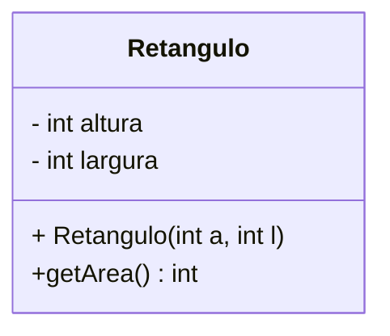
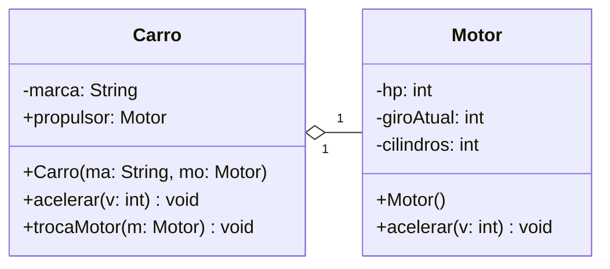

# Diagrama de classes UML

```mermaid
classDiagram
    
    class Retangulo{
        - int altura
        - int largura
        + Retangulo(int a, int l)
        +getArea() int
    }

```

[//]: # ( Atividade carro)

```mermaid
classDiagram
    direction LR
    
    class Carro{
        -marca: String
        +propulsor: Motor
        +Carro(ma: String, mo: Motor)
        +acelerar(v: int) void
        +trocaMotor(m: Motor) void
    }    
    class Motor{
        -hp: int
        -giroAtual: int
        -cilindros: int
        +Motor()
        +acelerar(v: int) void
    }
    
    Carro"1" o-- "1"Motor
    
```