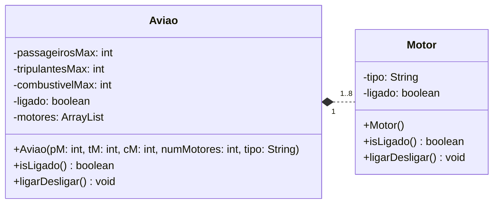

# Diagrama de classes UML Avião

```mermaid
classDiagram
    direction LR

    class Aviao {
        -passageirosMax: int
        -tripulantesMax: int
        -combustivelMax: int
        -ligado: boolean
        -motores: ArrayList<Motor>    
        +Aviao(pM: int, tM: int, cM: int, numMotores: int, tipo: String)
        +isLigado() boolean
        +ligarDesligar() void
        
    }    
    class Motor{
        -tipo: String
        -ligado: boolean
        +Motor()
        +isLigado() boolean
        +ligarDesligar() void
        
    }
    
    Aviao"1" *.. "1..8"Motor
    
```