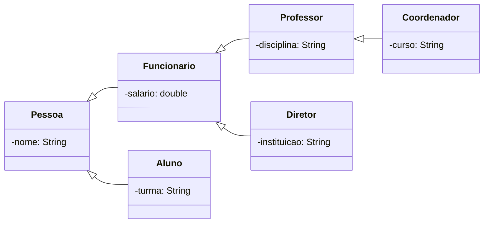
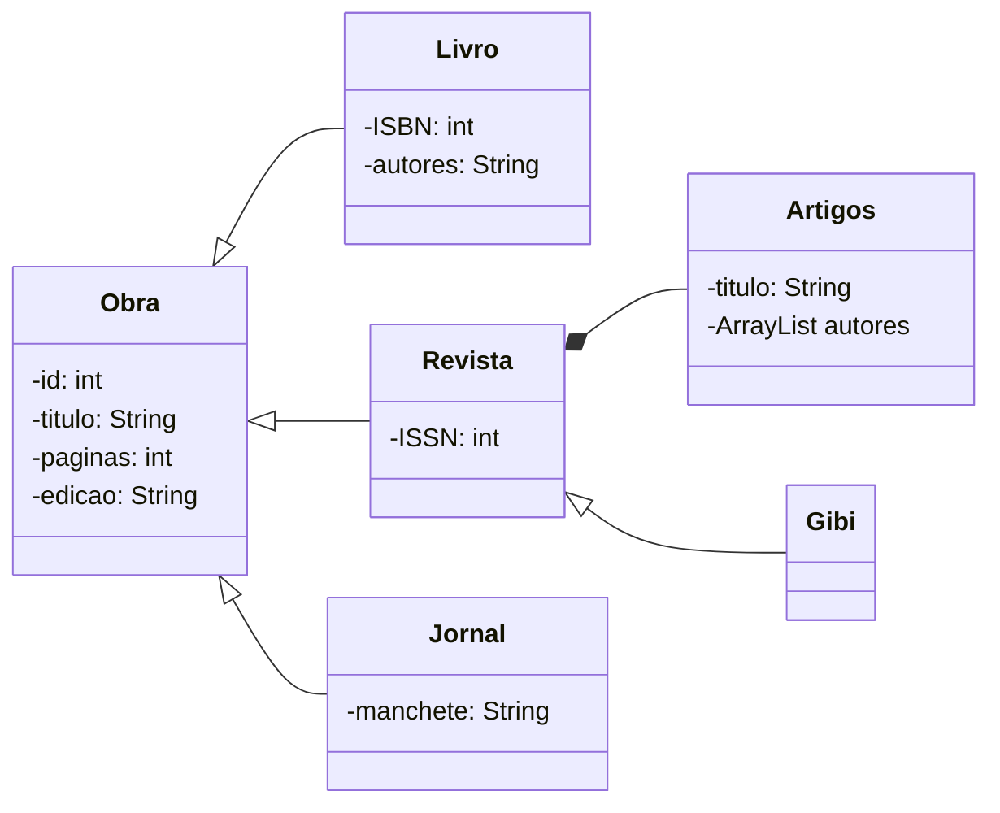
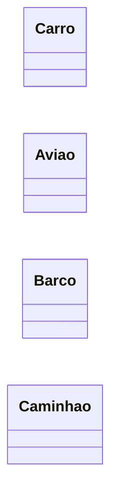
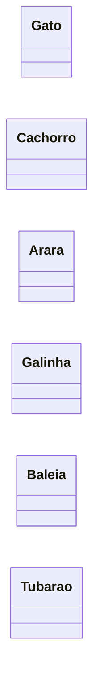

# Exercícios 

## 1 - Sistema Escola

```mermaid    
classDiagram
    direction LR
    
    class Pessoa{
        -nome: String        
    }
    class Funcionario{
        -salario: double
    }
    
    class Aluno{        
        -turma: String
 }
 
    class Professor{        
        -disciplina: String        
    }
    
    class Coordenador{        
        -curso: String        
    }
    class Diretor{
        -instituicao: String
        
    }

    Pessoa <|-- Aluno
    Pessoa <|-- Funcionario
    Funcionario <|-- Diretor
    Funcionario <|-- Professor    
    Professor <|-- Coordenador  
    
    

```

## 2 - Sistema Livraria

```mermaid    
classDiagram
    
    direction LR
    
    class Obra{
        -id: int
        -titulo: String
        -paginas: int
        -edicao: String
    }
    
    class Livro{     
        -ISBN: int
        -autores: String        
    }
    
    class Revista{
        -ISSN: int
        
    }
    class Jornal{
        -manchete: String
        
    }
    class Gibi{
        
    }
    
    class Artigos{
        -titulo: String
        -ArrayList<Autores> autores
    }
    
    Obra <|-- Livro
    Obra <|-- Revista
    Revista *-- Artigos
    Revista <|-- Gibi
    Obra <|-- Jornal

```

## 3 - Sistema Veículos

```mermaid    
classDiagram
    
    direction LR
    
    class Carro{
        
    }
    
    class Aviao{
        
    }
    class Barco{
        
    }
    class Caminhao{
        
    }

```

## 4 - Sistema Fazenda

```mermaid    
classDiagram
    
    direction LR
    
    class Gato{
        
    }
    
    class Cachorro{
        
    }
    class Arara{
        
    }
    class Galinha{
        
    }
    class Baleia{
        
    }
    class Tubarao{
        
    }

```