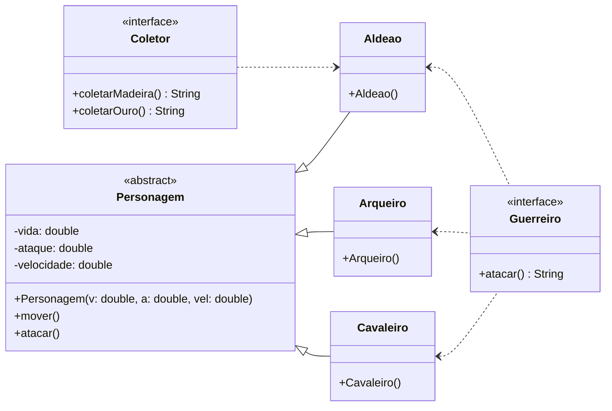

# Java of Empires

```mermaid    
classDiagram
    direction LR
    
    class Personagem{
        <<abstract>>
        
        -vida: double
        -ataque: double
        -velocidade: double
        +Personagem(v: double, a: double, vel: double)
        +mover()
        +atacar()
        
    }

class Aldeao{
    +Aldeao()
}
    
    class Arqueiro{        
        +Arqueiro()        
    }
    class Cavaleiro{        
        +Cavaleiro()        
    }
    
    class Coletor{
        <<interface>>        
        +coletarMadeira() String
        +coletarOuro() String
    }
    
    class Guerreiro{
        <<interface>>
        +atacar() String
    }
    
    Personagem <|-- Aldeao
    Personagem <|-- Arqueiro
    Personagem  <|-- Cavaleiro
    Aldeao <.. Guerreiro
    Arqueiro <.. Guerreiro
    Cavaleiro <.. Guerreiro
    Coletor ..> Aldeao
    

```