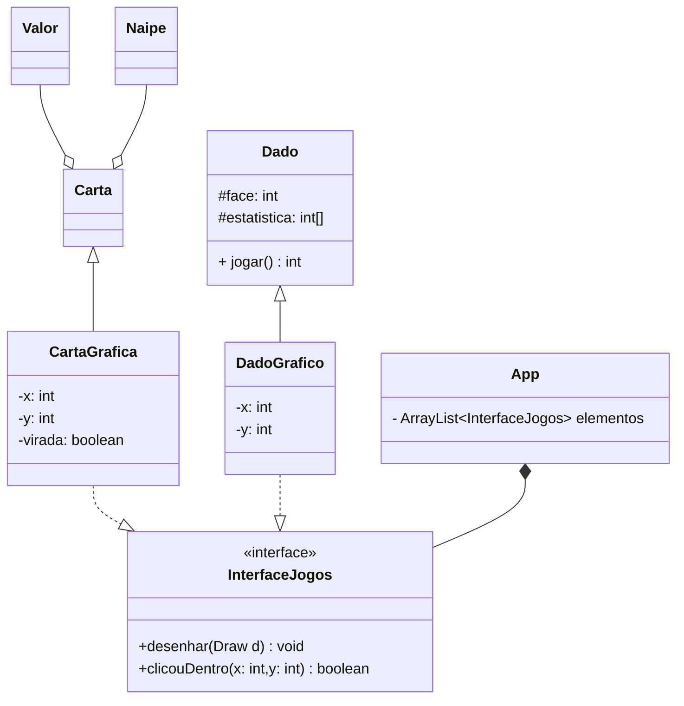

```mermaid
classDiagram
    direction TB

    Carta <|-- CartaGrafica
    Valor --o Carta
    Naipe --o Carta
    Dado <|-- DadoGrafico
    CartaGrafica ..|> InterfaceJogos
    DadoGrafico ..|> InterfaceJogos
    App *-- InterfaceJogos
    
    class InterfaceJogos{
        <<interface>>        
        +desenhar(Draw d) void
        +clicouDentro(x: int,y: int) boolean
    }
    
    class App{
        - ArrayList~InterfaceJogos~ elementos
    }
    
    
    class Dado{
        #face: int
        #estatistica: int[]
        + jogar() int        
    }
    
    class DadoGrafico{
        -x: int
        -y: int            
    }
    
    class CartaGrafica{
        -x: int
        -y: int
        -virada: boolean
    }
```