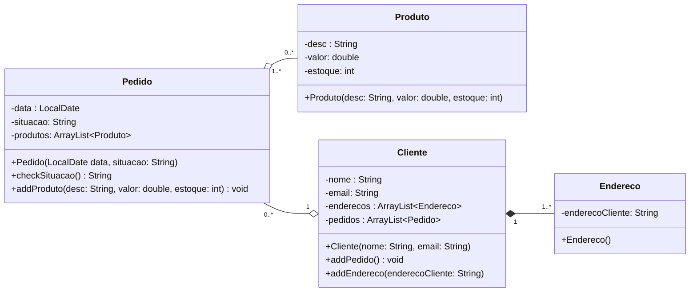
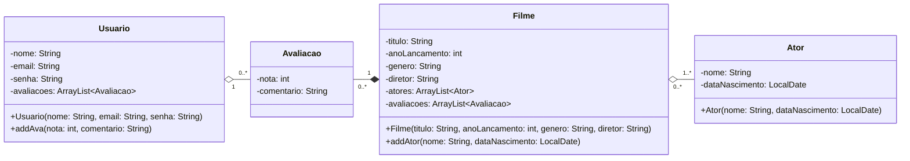
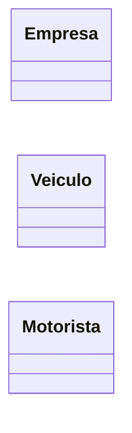

# lab-04 : Classe UML

## 1.1 - Sistema de comérico eletrônico

```mermaid
    classDiagram
        
        direction LR
        
               
        class Produto{
            -desc : String
            -valor: double
            -estoque: int
            +Produto(desc: String, valor: double, estoque: int)
        }
        
        class Cliente{
            -nome : String
            -email: String
            -enderecos : ArrayList~Endereco~
            -pedidos : ArrayList~Pedido~
            +Cliente(nome: String, email: String)
            +addPedido() void
            +addEndereco(enderecoCliente: String)
            
        }
        
        class Endereco{
            -enderecoCliente: String
            +Endereco() 
            
        }
        
        class Pedido{
            -data : LocalDate
            -situacao: String
            -produtos: ArrayList~Produto~
            +Pedido(LocalDate data, situacao: String)
            +checkSituacao() String
            +addProduto(desc: String, valor: double, estoque: int) void
        }
        
        Pedido"1..*" o-- "0..*"Produto
        Pedido"0..*" --o "1"Cliente
        Cliente"1" *-- "1..*"Endereco
    

```

## 1.2 - Sistema de avaliações de filme

```mermaid
    classDiagram
        
        direction LR
        
               
        class Filme{
            -titulo: String
            -anoLancamento: int
            -genero: String
            -diretor: String
            -atores: ArrayList~Ator~
            -avaliacoes: ArrayList~Avaliacao~
            +Filme(titulo: String, anoLancamento: int, genero: String, diretor: String)
            +addAtor(nome: String, dataNascimento: LocalDate)        
        }
        
        class Ator{
            -nome: String
            -dataNascimento: LocalDate
            +Ator(nome: String, dataNascimento: LocalDate)
        }
        
        class Usuario{
            -nome: String
            -email: String
            -senha: String
            -avaliacoes: ArrayList~Avaliacao~
            +Usuario(nome: String, email: String, senha: String)
            +addAva(nota: int, comentario: String)
        }
        class Avaliacao{
            -nota: int
            -comentario: String
            
        }
        
        Filme"0..*" o-- "1..*"Ator
        Avaliacao"0..*" --* "1"Filme
        Usuario"1" o-- "0..*"Avaliacao
```

## 1.3 - Sistema de gestão de frotas

```mermaid

classDiagram
    
    direction LR
    
    class Empresa{
        
    }
    
    class Veiculo{
        
    }
    
    class Motorista{
        
    }
    


```