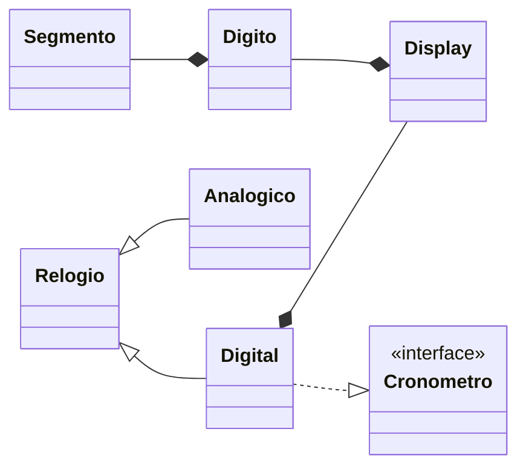

# Relógios

```mermaid
classDiagram
    
        direction LR
        
        class Relogio{
            
        }
        
        class Digital{
            
        }
        
        class Analogico{
            
        }
        
        class Display{
            
            
        }
        class Cronometro{
            <<interface>>

        }
        
        class Digito{
            
        }
        
        class Segmento{
            
        }
        
        Relogio <|-- Digital
        Relogio <|-- Analogico
        Digital *-- Display
        Digital ..|> Cronometro
        Segmento --* Digito
        Digito --* Display


```